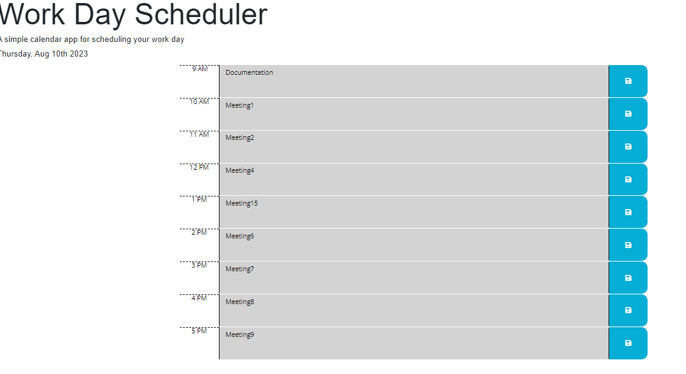

The work day schefuler is designed to help users to manage their time during business hours (9AM to 5PM)
Key feature : Providing users with the status of time(Past, present or future)

github URL    : https://github.com/hineeraja/Work-day-scheculer
deployed site :https://hineeraja.github.io/Work-day-scheculer/